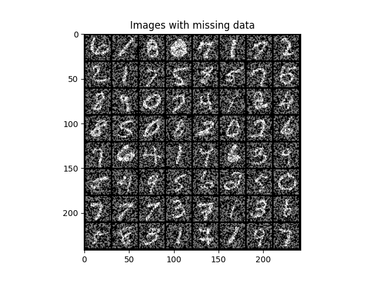
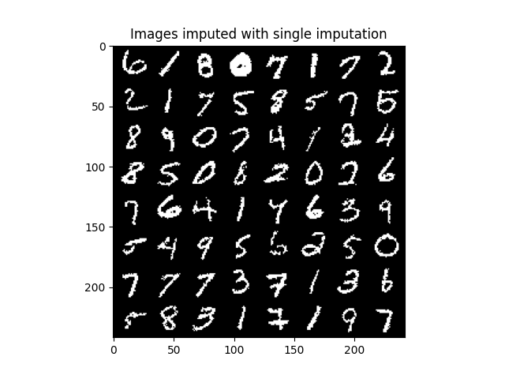
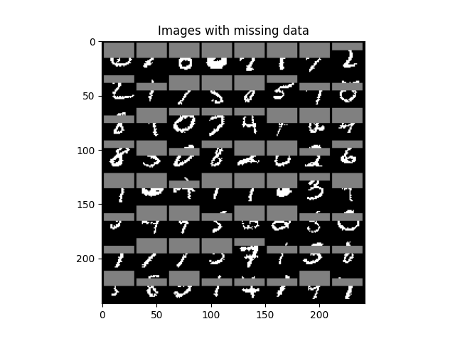
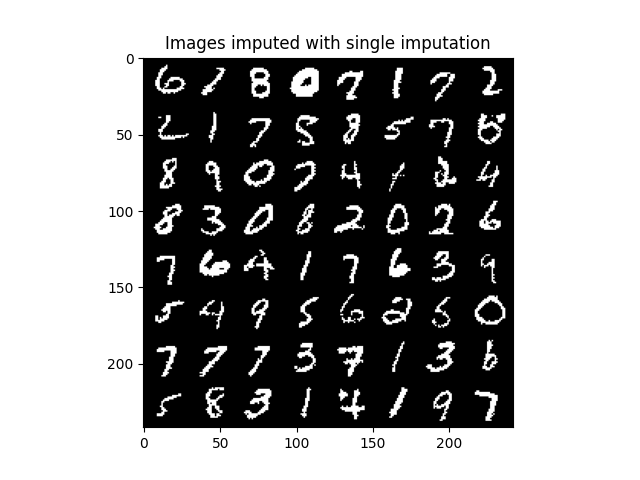

# PyTorch implementation of MIWAE

Personal implementation of the ICML paper ''MIWAE: Deep Generative Modelling and Imputation of Incomplete Data Sets" by Pierre-Alexandre Mattei and Jes Frellsen. Experiments on binarized MNIST available, boh for missing-completely-at-random and missing-at-random data.

## Missing-completely-at-random (MCAR)

  |  

## Missing-at-random (MAR)

  |  